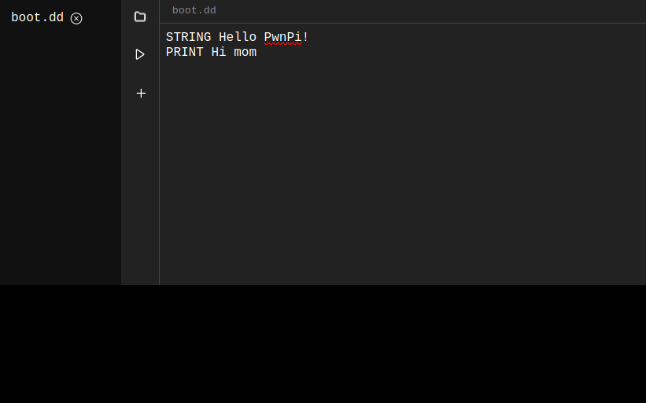

# PwnPi - A More Offensive Redteam Appliance

PwnPi Amora is a wireless keystroke injection tool built on the Raspberry Pi Pico W using CircuitPython.

The project makes an attempt to provide a fully featured web IDE for building
and deploying keystroke injection scripts.

## Getting Started

Check out the [wiki](https://github.com/lavafroth/pwnpi-amora/wiki/Quick-Start) for getting started.
