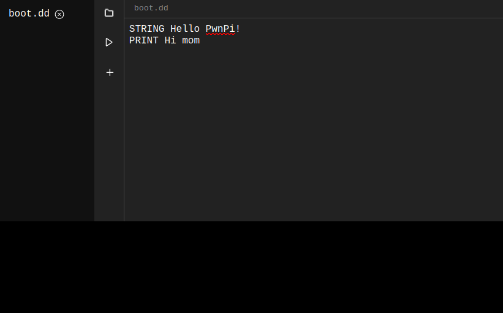

# PwnPi - A More Offensive Redteam Appliance

PwnPi Amora is a wireless keystroke injection tool built on the Raspberry Pi Pico W using CircuitPython.

Web IDE for and deploying keystroke injection scripts over WiFi.



## Getting Started

- Clone this repo
- Hold the BOOTSEL button an plug the device in
- Run the following inside the project directory

```sh
uv sync
source .venv/bin/activate
circuitpython-tool uf2 install --board raspberry_pi_pico_w
circup install asyncio adafruit_hid adafruit_httpserver
```

- Copy all files inside the `src/` directory to the board.

Check out the [wiki](https://github.com/lavafroth/pwnpi-amora/wiki/) for getting started.
